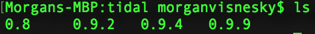

#### How to see if you have multiple tidal installs that maybe interfering with one another:

###### On macOS In a terminal window enter and evaluate the following commands:

* `cd ~./cabal/`
* `cd packages`
* `cd hackage.haskell.org`
* `cd tidal`
* `ls`

#### If there is more than one version listed like the photo below, this could possibly cause you some grief.

If you use tidal with midi, your midi install is stored in the `tidal-midi` 
directory inside of the `hackage.haskell.org` directory, it should look very similar to the image above, except only one version should be listed.

I would recommend removing old installs if you find them.

---
If you can manage to delete all installs and want to start from a clean slate, this makes things easier:
###### Tested on my macbook and imac with macOS High Sierra 10.13.4  Use at your own risk
[Modified install script for macOS](https://github.com/vism2889/tidal-bootstrap)
